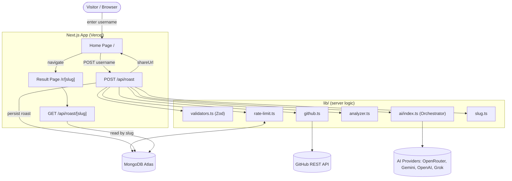
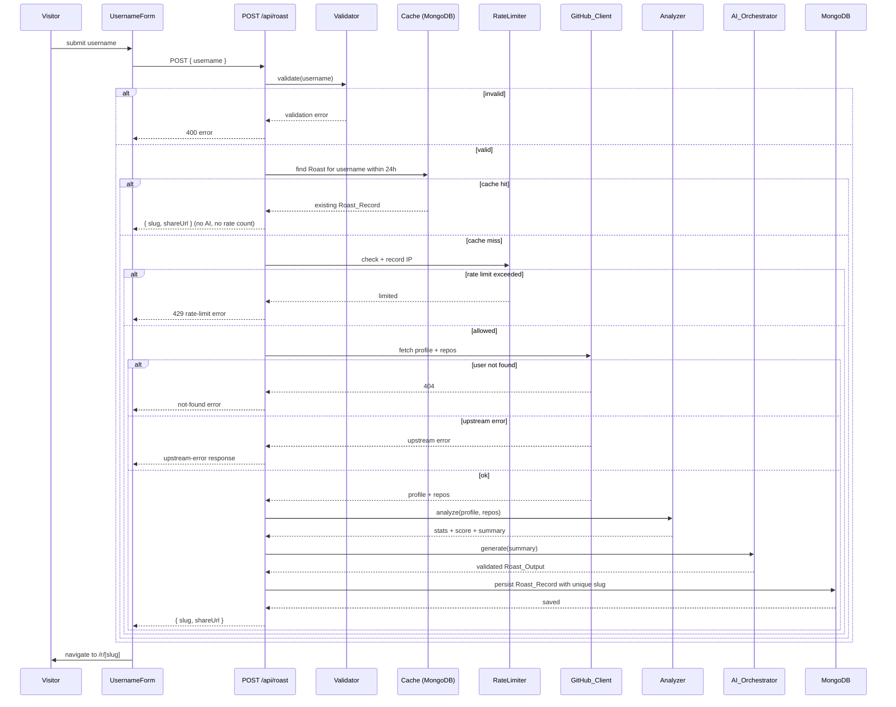

# Design Document

## Overview

GitRoasted is an AI-powered GitHub roast generator built on Next.js (App Router) with TypeScript. A visitor submits a public GitHub username; the system validates it, checks a MongoDB cache, fetches public GitHub profile and repository data, analyzes the profile into statistics and a developer score, generates a funny-but-safe roast through a multi-provider AI fallback chain, persists the result with a unique slug, and returns a public shareable link. The result page at `/r/[slug]` is viewable without authentication.

This design covers the MVP scope defined in the requirements: home page, username input, GitHub data fetch, profile analysis and scoring, AI fallback system, output validation, MongoDB persistence with slug generation, public result page, copy-link action, IP-based rate limiting, and 24-hour caching. Out of scope: authentication, dashboards, user accounts, leaderboard, and downloadable roast cards.

### Design Goals

- **Resilience**: A roast result is always produced even when every external AI provider fails (rule-based engine, then hardcoded default).
- **Token economy**: Cached roasts (within a 24h window) and per-IP rate limiting protect AI token spend.
- **Data integrity**: AI output is strictly validated against a Zod schema before it can be persisted or displayed.
- **Separation of concerns**: Transport (GitHub client, AI providers), logic (analyzer, orchestrator, validators), persistence (Mongoose models), and presentation (React components) are cleanly separated under `lib/`, `models/`, and `app/`/`components/`.

### Key Technical Decisions

| Decision | Rationale |
| --- | --- |
| Next.js 16+ App Router + Route Handlers | Co-locates the public pages and the JSON API in one deployable unit on Vercel; server components handle data fetching for the result page. |
| MongoDB Atlas + Mongoose | Document model fits the nested `githubProfile`/`githubStats`/`analysis` shape directly; Mongoose gives schema enforcement and a unique index on `slug`. |
| Zod for input and AI output | Single validation library for both the username request and the strict AI JSON contract; parse failures become typed errors. |
| Multi-provider AI chain with rule-based fallback | No single provider is a single point of failure; the rule-based engine guarantees a result without tokens. |
| MongoDB-based rate limiter | No extra infrastructure (Redis) needed for MVP; a `RateLimit` collection keyed by IP with a sliding window. |

## Architecture

### System Context



### Roast Generation Sequence



### Layered Structure

- **Presentation layer** (`app/`, `components/`): home page, username form, result page, copy-link control. Server components fetch by slug; client components handle form submission and clipboard.
- **API layer** (`app/api/roast/route.ts`, `app/api/roast/[slug]/route.ts`): orchestrates the request lifecycle, owns HTTP status mapping.
- **Logic layer** (`lib/`): `validators.ts`, `github.ts`, `analyzer.ts`, `ai/*`, `slug.ts`, `rate-limit.ts`. Pure where possible to maximize testability.
- **Persistence layer** (`models/`, `lib/db.ts`): Mongoose connection and `Roast` / `RateLimit` models.

## Components and Interfaces

### Username_Validator — `lib/validators.ts`

Uses Zod. The username schema enforces the GitHub username rule via regex, trimming, and length.

```ts
import { z } from "zod";

export const GITHUB_USERNAME_REGEX =
  /^[a-zA-Z0-9]([a-zA-Z0-9-]{0,37}[a-zA-Z0-9])?$/;

export const usernameSchema = z
  .string()
  .trim()
  .min(1, "Username is required")
  .max(39, "Username must be at most 39 characters")
  .regex(GITHUB_USERNAME_REGEX, "Invalid GitHub username");

export const roastRequestSchema = z.object({
  username: usernameSchema,
  roastMode: z.enum(["brutal", "playful"]).optional(),
});

export function validateUsername(input: unknown):
  | { ok: true; username: string }
  | { ok: false; error: string };
```

Note: the regex alone already rejects leading/trailing hyphens, disallowed characters, and lengths over 39. Empty/whitespace-only strings are rejected by `trim().min(1)`.

### GitHub_Client — `lib/github.ts`

Wraps the GitHub REST API (`https://api.github.com`). Uses `GITHUB_TOKEN` for higher rate limits.

```ts
export interface GitHubProfile {
  login: string;
  name: string | null;
  avatarUrl: string;
  bio: string | null;
  followers: number;
  following: number;
  publicRepos: number;
  profileUrl: string;
  blog: string | null;
  company: string | null;
  location: string | null;
  createdAt: string; // ISO
}

export interface GitHubRepo {
  name: string;
  description: string | null;
  language: string | null;
  stargazersCount: number;
  forksCount: number;
  fork: boolean;
  homepage: string | null;
  pushedAt: string; // ISO
}

export type GitHubFetchResult =
  | { ok: true; profile: GitHubProfile; repos: GitHubRepo[] }
  | { ok: false; kind: "not_found" | "upstream_error"; message: string };

export async function fetchGitHubData(username: string): Promise<GitHubFetchResult>;
```

Behavior: GET `/users/{username}` then GET `/users/{username}/repos?per_page=100&sort=updated`. A 404 on the profile maps to `not_found`. Any 403/429/5xx or network failure maps to `upstream_error`. A profile that exists with an empty repos array returns `ok: true` with `repos: []`.

### Profile_Analyzer — `lib/analyzer.ts`

Pure function. Computes statistics, the developer score, and a compact AI summary.

```ts
export interface GitHubStats {
  totalReposAnalyzed: number;
  totalStars: number;
  totalForks: number;
  topLanguages: string[];
  reposWithDescription: number;
  reposWithoutDescription: number;
  reposWithHomepage: number;
  recentlyUpdatedRepos: number;
  forkedRepos: number;
  originalRepos: number;
}

export interface AnalysisResult {
  stats: GitHubStats;
  score: number;        // integer 0..100
  summary: string;      // compact text for the AI prompt
}

export function analyzeProfile(
  profile: GitHubProfile,
  repos: GitHubRepo[],
): AnalysisResult;
```

Scoring model (clamped to `[0, 100]`, rounded to an integer):

- Base 0, plus weighted contributions for repo count, total stars, total forks, language diversity, description coverage ratio, presence of bio/blog/company, and recent activity.
- Each contribution is bounded so no single signal can push the score past its cap; the final value is `Math.max(0, Math.min(100, Math.round(raw)))`.

For a zero-repository profile, all repo-derived stats are `0` (not omitted), and the score is computed from profile-only signals.

The `summary` is a compact multi-line string embedding the key stats, used as `{{GITHUB_SUMMARY}}` in the AI prompt.

### AI_Orchestrator — `lib/ai/index.ts`

Attempts providers in priority order, validates each response, falls back to the rule-based engine, and finally to a hardcoded default.

```ts
export interface RoastOutput {
  score: number;            // 0..100
  grade: string;
  title: string;
  shortRoast: string;
  longRoast: string;
  strengths: string[];
  weaknesses: string[];
  improvementTips: string[];
  shareCaption: string;
}

export interface AiMeta {
  providerUsed: string;     // e.g. "openrouter" | "gemini" | ... | "rule_based" | "default"
  modelUsed: string;
  aiFailed: boolean;        // true if all external providers failed
  fallbackUsed: boolean;    // true if rule-based or default was used
}

export interface GenerationResult {
  roast: RoastOutput;
  aiMeta: AiMeta;
}

export interface AiProvider {
  name: string;
  model: string;
  generate(summary: string): Promise<unknown>; // raw, unvalidated
}

export async function generateRoast(
  summary: string,
  analyzerScore: number,
): Promise<GenerationResult>;
```

Provider order: OpenRouter → Gemini → OpenAI → Grok/xAI → Rule-based → Default. Each provider module (`openrouter.ts`, `gemini.ts`, `openai.ts`, `grok.ts`) implements `AiProvider` and only handles its HTTP call. The orchestrator runs each `generate`, parses the raw result with `roastOutputSchema`, and on any throw or validation failure moves to the next provider.

### Roast_Output schema — `lib/validators.ts`

```ts
export const roastOutputSchema = z.object({
  score: z.number().int().min(0).max(100),
  grade: z.string().min(1),
  title: z.string().min(1),
  shortRoast: z.string().min(1),
  longRoast: z.string().min(1),
  strengths: z.array(z.string()),
  weaknesses: z.array(z.string()),
  improvementTips: z.array(z.string()),
  shareCaption: z.string().min(1),
});

export function parseRoastOutput(raw: unknown):
  | { ok: true; value: RoastOutput }
  | { ok: false; error: string };
```

A score outside `0..100` fails `min(0).max(100)`, so the response is treated as invalid and the fallback chain continues.

### Rule_Based_Engine — `lib/ai/fallback.ts`

```ts
export function ruleBasedRoast(
  profile: GitHubProfile,
  stats: GitHubStats,
  score: number,
): RoastOutput;

export const DEFAULT_ROAST: RoastOutput; // hardcoded, always valid
```

Builds roast lines from heuristics (missing bio, low repo count, zero stars, many repos without descriptions, single-language portfolio) and derives a grade from the analyzer score. `DEFAULT_ROAST` is a constant that always satisfies `roastOutputSchema`.

### Slug generator — `lib/slug.ts`

```ts
export function generateSlug(username: string): string; // `${normalized}-${randomId}`
```

Lowercases the username, strips characters outside `[a-z0-9-]`, and appends a random short id (5 alphanumeric chars). The API retries on the rare unique-index collision.

### Rate_Limiter — `lib/rate-limit.ts`

```ts
export type RateLimitResult =
  | { allowed: true; remaining: number }
  | { allowed: false; retryAfterSeconds: number };

export async function checkAndRecord(ip: string): Promise<RateLimitResult>;
```

Reads the `RateLimit` document for the IP. If `windowStart` is older than the window (`RATE_LIMIT_PER_HOUR` over 1 hour), it resets `requests` to 1 and `windowStart` to now. Otherwise it increments `requests`. If `requests` would exceed the limit, it returns `allowed: false` and does not count the over-limit attempt as a successful generation. Called only on cache-miss paths so cached requests never count.

### API Routes

**`POST /api/roast`** — orchestrates: validate → cache lookup → (on miss) rate-limit → fetch → analyze → generate → persist → respond.

```ts
// Success
{ "success": true, "slug": "ahmmikun-x7k92", "shareUrl": "https://.../r/ahmmikun-x7k92" }
// Error
{ "success": false, "error": { "code": "VALIDATION" | "RATE_LIMIT" | "NOT_FOUND" | "UPSTREAM" | "GENERATION", "message": string } }
```

Status mapping: `VALIDATION` → 400, `RATE_LIMIT` → 429, `NOT_FOUND` → 404, `UPSTREAM` → 502, `GENERATION` → 500.

**`GET /api/roast/[slug]`** — returns the `Roast_Record` for the slug, or 404 when none exists.

### Frontend Components

- `app/page.tsx` (Home): hero section + `UsernameForm`; renders a fallback error state if primary content fails.
- `components/roast/UsernameForm.tsx` (client): controlled input, client-side Zod validation mirror, loading state during submit, POSTs to `/api/roast`, navigates to `/r/[slug]` on success, shows inline error on failure.
- `app/r/[slug]/page.tsx` (Result, server component): fetches the record by slug and renders avatar, username, score circle, grade badge, title, short/long roast, stats grid, strengths, weaknesses, tips, share caption, and the copy-link control; renders a not-found view when the slug has no record.
- `components/roast/ShareButtons.tsx` (client): copies `shareUrl` to clipboard via the Clipboard API, shows confirmation on success and an error message on failure.

## Data Models

### Roast model — `models/Roast.ts`

```ts
const RoastSchema = new Schema({
  slug: { type: String, required: true, unique: true, index: true },
  username: { type: String, required: true, index: true },

  githubProfile: {
    login: String,
    name: String,
    avatarUrl: String,
    bio: String,
    followers: Number,
    following: Number,
    publicRepos: Number,
    profileUrl: String,
    blog: String,
    company: String,
    location: String,
    createdAt: Date,
  },

  githubStats: {
    totalReposAnalyzed: Number,
    totalStars: Number,
    totalForks: Number,
    topLanguages: [String],
    reposWithDescription: Number,
    reposWithoutDescription: Number,
    reposWithHomepage: Number,
    recentlyUpdatedRepos: Number,
    forkedRepos: Number,
    originalRepos: Number,
  },

  analysis: {
    score: Number,
    grade: String,
    title: String,
    shortRoast: String,
    longRoast: String,
    strengths: [String],
    weaknesses: [String],
    improvementTips: [String],
    shareCaption: String,
  },

  aiMeta: {
    providerUsed: String,
    modelUsed: String,
    aiFailed: Boolean,
    fallbackUsed: Boolean,
  },

  publicStats: {
    views: { type: Number, default: 0 },
    shares: { type: Number, default: 0 },
  },
}, { timestamps: true }); // createdAt, updatedAt
```

The `username` index supports the cache lookup (`username` + `createdAt` within window). The unique index on `slug` enforces slug uniqueness at the database level.

### RateLimit model — `models/RateLimit.ts`

```ts
const RateLimitSchema = new Schema({
  ip: { type: String, required: true, unique: true, index: true },
  requests: { type: Number, required: true, default: 0 },
  windowStart: { type: Date, required: true },
  lastRequestAt: { type: Date, required: true },
});
```

### Configuration

Environment-driven values: `CACHE_DURATION_HOURS` (default 24), `RATE_LIMIT_PER_HOUR` (default 5), `AI_PRIMARY_PROVIDER`, provider API keys/models, `GITHUB_TOKEN`, `MONGODB_URI`, `NEXT_PUBLIC_APP_URL`.

## Correctness Properties

*A property is a characteristic or behavior that should hold true across all valid executions of a system — essentially, a formal statement about what the system should do. Properties serve as the bridge between human-readable specifications and machine-verifiable correctness guarantees.*

These properties target the pure logic of GitRoasted (validation, analysis/scoring, rate-limit windowing, caching decision, AI fallback orchestration, output validation, slug generation, persistence round-trip, and result rendering). UI wiring, navigation, clipboard interactions, and external-service calls are covered by example-based and integration tests in the Testing Strategy instead.

### Property 1: Username validation matches the GitHub rule

*For any* input string, the validator accepts it if and only if its trimmed form is non-empty, at most 39 characters, and matches `^[a-zA-Z0-9]([a-zA-Z0-9-]{0,37}[a-zA-Z0-9])?$` (i.e. no disallowed characters, no leading/trailing hyphen).

**Validates: Requirements 1.1, 1.2, 1.3, 1.4, 1.5**

### Property 2: Rate limiter enforces the per-IP window

*For any* sequence of AI-requiring requests from a single IP with timestamps, a request is allowed if and only if the cumulative number of requests within the current (non-elapsed) window is at most the configured limit; once the window elapses the count resets so a subsequent request is allowed again.

**Validates: Requirements 3.1, 3.2, 3.3, 3.5**

### Property 3: Cached requests do not consume rate budget

*For any* request served entirely from a valid cached record, the IP's recorded request count is unchanged.

**Validates: Requirements 3.4**

### Property 4: Analyzer aggregation is consistent

*For any* profile and list of repositories, the computed `totalStars` equals the sum of repository stars, `totalForks` equals the sum of repository forks, `reposWithDescription + reposWithoutDescription` equals `totalReposAnalyzed`, `originalRepos + forkedRepos` equals `totalReposAnalyzed`, and an empty repository list yields zero for every repository-derived statistic (present, not omitted).

**Validates: Requirements 6.1, 6.2**

### Property 5: Developer score is a bounded integer

*For any* profile and list of repositories, the computed Developer_Score is an integer in the inclusive range 0 to 100.

**Validates: Requirements 6.3**

### Property 6: Analyzer produces a usable summary

*For any* profile and list of repositories, the analyzer produces a non-empty compact summary string that reflects the computed statistics.

**Validates: Requirements 6.4**

### Property 7: Cache decision depends only on record age

*For any* roast request, an existing record is reused (and GitHub fetch and AI generation are skipped) if and only if a record for that username exists with an age within the Cache_Window; otherwise the pipeline proceeds to fetch and generate.

**Validates: Requirements 4.2, 4.3**

### Property 8: AI fallback chain order and validity

*For any* configuration of provider outcomes (each provider either throws, returns an invalid response, or returns a valid response), the orchestrator attempts providers in the order OpenRouter, Gemini, OpenAI, Grok, skips every provider whose response fails Roast_Output validation, and returns the output of the first provider that yields a valid response.

**Validates: Requirements 7.1, 7.2, 7.3, 8.1, 8.3**

### Property 9: Generation always yields a valid roast

*For any* configuration of provider outcomes — including all external providers failing and the rule-based engine failing — `generateRoast` returns a Roast_Output that satisfies the Roast_Output schema.

**Validates: Requirements 7.4**

### Property 10: AI metadata reflects the producing path

*For any* configuration of provider outcomes, the recorded `aiMeta` identifies the provider that produced the roast, sets `aiFailed` to true if and only if every external provider failed, and sets `fallbackUsed` to true if and only if the roast came from the rule-based engine or the hardcoded default.

**Validates: Requirements 7.5**

### Property 11: Out-of-range scores are rejected

*For any* otherwise-valid roast object whose score is outside the inclusive range 0 to 100, Roast_Output validation fails (and the provider attempt is treated as failed).

**Validates: Requirements 8.2**

### Property 12: Slug format

*For any* valid username, the generated slug equals the normalized username (lowercased, restricted to `[a-z0-9-]`) followed by a hyphen and a random alphanumeric suffix, matching `^[a-z0-9-]+-[a-z0-9]+$`.

**Validates: Requirements 9.1**

### Property 13: Persistence round-trip and share URL

*For any* produced Roast_Output and analysis, persisting a Roast_Record and then reading it back by slug yields equal `slug`, `username`, `githubProfile`, `githubStats`, `analysis`, and `aiMeta` fields, and the returned share URL ends with `/r/{slug}`.

**Validates: Requirements 9.2, 9.4**

### Property 14: Slug uniqueness

*For any* number of slugs generated for the same username, the generated suffixes make collisions vanishingly unlikely, and the persistence layer's unique constraint guarantees no two stored records share a slug.

**Validates: Requirements 9.3**

### Property 15: Result rendering includes all record fields

*For any* persisted Roast_Record, rendering the result view produces output that contains the username, avatar, Developer_Score, grade, roast title, short roast, long roast, each GitHub statistic, every strength, every weakness, and every improvement tip.

**Validates: Requirements 10.1**

## Error Handling

Errors are normalized into typed results inside `lib/` and mapped to HTTP responses at the API boundary. The frontend renders user-facing messages from the returned error code.

| Source | Condition | Internal result | API status | User-facing behavior |
| --- | --- | --- | --- | --- |
| Username_Validator | Invalid/empty/over-length username | `{ code: "VALIDATION" }` | 400 | Inline form error; visitor stays on form (Req 2.4). |
| Rate_Limiter | IP over hourly limit (cache-miss path only) | `{ code: "RATE_LIMIT", retryAfterSeconds }` | 429 | "Too many roasts. Try again later." No generation (Req 3.2). |
| GitHub_Client | Profile 404 | `{ kind: "not_found" }` → `{ code: "NOT_FOUND" }` | 404 | "GitHub user not found." No roast (Req 5.3). |
| GitHub_Client | 403/429/5xx/network | `{ kind: "upstream_error" }` → `{ code: "UPSTREAM" }` | 502 | "GitHub is unavailable, try again." (Req 5.4). |
| AI_Orchestrator | Single provider throws or returns invalid output | caught internally | — | Transparent; chain continues to next provider (Req 7.2, 8.3). |
| AI_Orchestrator | All providers + rule-based fail | returns `DEFAULT_ROAST` | — | A valid roast is always produced (Req 7.4). |
| Persistence | Slug unique-index collision | retry slug generation (bounded retries) | — | Transparent; new slug generated. |
| Persistence | Write fails / no valid output | `{ code: "GENERATION" }` | 500 | Error response; no share URL returned (Req 4.4). |
| Result page | Slug has no record | not-found view | 404 | "Roast not found." (Req 10.2). |
| Clipboard | `writeText` rejects | caught in client | — | Error message shown (Req 11.3). |
| Home page | Primary content render failure | error boundary | — | Fallback error state (Req 12.3). |

Principles:
- The AI layer never throws to the API; provider failures are absorbed by the fallback chain so a result is always available.
- GitHub errors are distinguished between `not_found` (user error) and `upstream_error` (transient/service) so the visitor gets an accurate message.
- A cache-miss that fails before producing a valid output never returns a share URL.

## Testing Strategy

### Dual Approach

- **Property-based tests** verify the 15 universal properties above across many generated inputs.
- **Unit tests** cover specific examples, boundaries, and error conditions.
- **Integration / component tests** cover external-service wiring (GitHub client, MongoDB) and UI interactions (form submission, navigation, clipboard) that are not universal logic properties.

### Property-Based Testing

- Library: **fast-check** with the project's test runner (Vitest or Jest). Do not hand-roll property testing.
- Each property test runs a **minimum of 100 iterations**.
- Each property test is tagged with a comment referencing its design property in the format:
  `// Feature: gitroasted, Property {number}: {property_text}`
- Generators:
  - Usernames: mix of valid GitHub usernames, strings with disallowed characters, leading/trailing hyphens, lengths around the 39 boundary, and whitespace-only strings (Properties 1, 12).
  - Repository lists: arbitrary arrays of repos with random stars, forks, language (including null), description (including null/empty), fork flag, homepage, and `pushedAt`; include the empty list (Properties 4, 5, 6).
  - Provider outcome configurations: arrays mapping each provider to `throw | invalid | valid`, including all-fail and rule-based-fail cases (Properties 8, 9, 10).
  - Roast objects: valid objects plus mutated variants with out-of-range scores and missing fields (Property 11).
  - Request/timestamp sequences for the rate limiter, with simulated time advancement past the window (Properties 2, 3).
  - Record ages relative to the cache window (Property 7).
- External effects (MongoDB, GitHub, AI HTTP) are **mocked** in property tests so 100+ iterations stay fast and deterministic; the rate limiter and cache logic are tested against an in-memory store or injected clock.

### Unit and Integration Tests

- **Validator boundaries** (Req 1.4, 1.5): explicit cases for 39-char (accept) vs 40-char (reject), `""`, and `"   "`.
- **GitHub client** (Req 5.1, 5.2, 5.3, 5.4, 5.5): mocked responses for success, 404, 403/5xx, and empty repo array; assert correct typed results.
- **Cache lookup** (Req 4.1) and **generation-failure path** (Req 4.4): example tests with mocked persistence.
- **AI provider modules**: example tests that each provider maps a mocked HTTP response into a raw object.
- **Slug uniqueness at DB level** (Req 9.3): integration test asserting the unique index rejects a duplicate insert.
- **UI component tests** (Req 2.1–2.4, 10.2, 10.3, 11.1–11.3, 12.1–12.3): submit valid/invalid username, loading state, success navigation, error display, not-found view, no-auth access, clipboard success/confirmation/failure, home hero/CTA rendering, and home fallback error state.

### Coverage Mapping

Every acceptance criterion is covered by at least one property test (logic), example/component test (UI), or integration test (external services). The Correctness Properties section maps each property to its originating requirements via the `Validates:` annotations.
