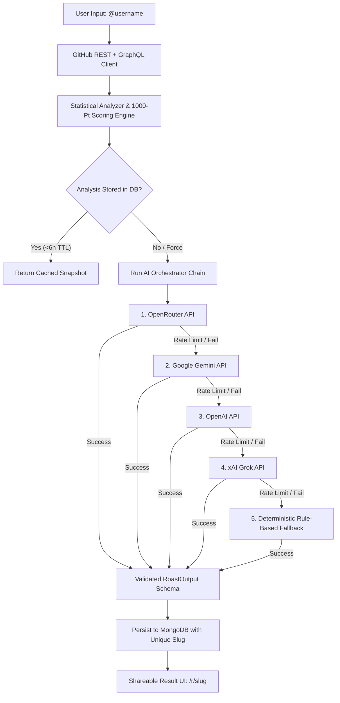

<div align="center">

# 🔥 GitRoasted

### *AI-Powered GitHub Roasts & 1000-Point Developer Scoring Platform*

Turn your GitHub commit history, repositories, and habits into a savage AI roast **and** an honest, data-backed **Developer Score** out of 1000 across eight core dimensions.

[](https://git-roasted-ai.vercel.app)
[](LICENSE)

<br/>

[](https://nextjs.org/)
[](https://react.dev/)
[](https://www.typescriptlang.org/)
[](https://www.mongodb.com/)
[](https://vitest.dev/)
[](https://fast-check.dev/)
[]()

</div>

---

## ⚡ What is GitRoasted?

**GitRoasted** is not just another toy joke generator. It combines ruthless, personality-driven AI roasts with an industrial-grade engineering audit. It queries the live GitHub REST and GraphQL APIs, measures your code hygiene, stars, commit regularity, licenses, and ecosystem diversity, and produces:

1. **A Savage AI Roast:** Context-aware roasts tuned to your specific languages, gaps, and habits.
2. **1000-Point Developer Score:** Eight deterministic, mathematically sound dimensions.
3. **Actionable Improvement Roadmap:** Factual *Quick Wins*, *Short-Term Goals*, and *Long-Term Upgrades* based on your real profile stats.
4. **Developer Head-to-Head Comparison:** Side-by-side metric diffs and shareable URLs.
5. **Global Organic Leaderboard:** Live ranking populated authentically by analyzed developers.

---

## 🚀 Key Features

- **🔥 Savage, Unfiltered Roasting:** Multi-provider AI orchestration delivers fresh, witty roasts every time.
- **📊 1,000-Point Scoring Engine:** 8 weighted dimensions with transparent points, breakdown, and tiers (`Mythic`, `Staff`, `Senior`, `Mid-Level`, `Junior`, `Script Kiddie`).
- **🛡️ 100% Guaranteed AI Fallback Chain:** `OpenRouter` ➔ `Gemini` ➔ `OpenAI` ➔ `Grok` ➔ `Deterministic Rule-Based Engine`. If every third-party LLM is down or rate-limited, GitRoasted *never crashes*.
- **🎯 Precision "How to Improve" Engine:** Real measured shortfalls dictate practical recommendations—no generic *"code more"* or *"read clean code"* filler.
- **⚔️ Developer Comparison:** Put any two GitHub usernames head-to-head with delta bars and dimensional strength badges.
- **🏆 Live Leaderboard:** Discover top developers worldwide, search by username, and explore ranking tiers.
- **⚡ Serverless-Safe Architecture:** Mongoose connection caching, TTL-based snapshot persistence, and per-IP token bucket rate limiting.
- **🎨 Neo-Brutalist Visual Design:** High-contrast retro aesthetics, kinetic borders, responsive layouts, accessible contrast, and zero layout shift.

---

## 📐 The 1000-Point Developer Score

Every score is 100% deterministic, transparent, and derived from verified GitHub data:

| Dimension | Max Points | Measured Signals |
| :--- | :---: | :--- |
| **💥 Impact** | **250** | Aggregate stars, forks, original vs. forked repo ratio, maximum star ceiling |
| **📅 Consistency** | **200** | Trailing 52-week contribution calendar, active streak weeks, push distribution |
| **💎 Quality** | **150** | Readme depth, open source licenses (MIT/Apache/GPL), topic tags, repo descriptions |
| **👥 Community** | **150** | Follower count, community participation signals |
| **🌐 Diversity** | **100** | Cross-language ecosystem breadth, polyglot distribution |
| **⏳ Experience** | **75** | GitHub account longevity, maturity of public work |
| **⚡ Activity** | **50** | Recent push activity (<90 days), active project count |
| **🎁 Bonuses** | **25** | Profile README, portfolio/website link, complete bio, verified affiliation |
| **TOTAL** | **1,000** | **Sum of all 8 dimensions** |

---

## 🤖 AI Resilience Architecture

GitRoasted separates statistical analysis from AI text generation. The **Developer Score is always calculated deterministically** by our engine, ensuring models cannot hallucinate scores.



---

## 🛠️ Tech Stack

| Domain | Technology |
| :--- | :--- |
| **Framework** | Next.js 16 (App Router, Turbopack, React 19) |
| **Language** | TypeScript (Strict Mode) |
| **Styling** | Vanilla CSS Tokens & Neo-Brutalist Design System |
| **Database** | MongoDB Atlas via Mongoose (Connection caching) |
| **Data Validation** | Zod v4 (Type-safe request & LLM payload parsing) |
| **AI Providers** | OpenRouter, Google Gemini, OpenAI, Grok / xAI |
| **Testing** | Vitest, Fast-Check (Property-based tests), JSDOM |
| **Icons & UI** | Lucide React, Radix UI Primitives |
| **Deployment** | Vercel Serverless Platform |

---

## 💻 Getting Started

### Prerequisites
- Node.js 20+ installed
- MongoDB connection string (local or [MongoDB Atlas](https://www.mongodb.com/cloud/atlas))
- GitHub Personal Access Token (classic or fine-grained with public read permission)
- *(Optional)* At least one AI API key (OpenRouter, Gemini, OpenAI, or Grok)

### Installation

```bash
# 1. Clone repository
git clone https://github.com/ahmmikun/GitRoasted.git
cd GitRoasted

# 2. Install dependencies
npm install

# 3. Setup environment variables
cp .env.example .env.local
```

Configure [.env.local](file:///.env.local) with your credentials:

```env
# Database
MONGODB_URI=mongodb+srv://<user>:<password>@cluster.mongodb.net/gitroasted

# GitHub Access Token (enables GraphQL contributions + high rate limits)
GITHUB_TOKEN=ghp_your_github_token_here

# Primary AI Provider (openrouter | gemini | openai | grok)
AI_PRIMARY_PROVIDER=openrouter
OPENROUTER_API_KEY=your_key_here
OPENROUTER_MODEL=anthropic/claude-3.5-haiku

# Application Settings
CACHE_DURATION_HOURS=24
RATE_LIMIT_PER_HOUR=5
NEXT_PUBLIC_APP_URL=http://localhost:3000
```

### Run Locally

```bash
npm run dev
```

Visit [http://localhost:3000](http://localhost:3000) to start roasting!

---

## 🧪 Testing & Quality Assurance

GitRoasted includes comprehensive test suites combining unit tests and **fast-check property-based tests** verifying mathematical invariants (e.g., scores never exceed bounds, partitions sum to total, slug idempotency):

```bash
# Run all 22 test suites (289 tests)
npm run test

# Run tests in watch mode
npm run test:watch

# TypeScript typecheck
npm run typecheck
```

---

## 📂 Project Architecture

```
GitRoasted/
├── app/                        # Next.js App Router
│   ├── api/
│   │   ├── compare/route.ts    # Side-by-side comparison endpoint
│   │   ├── improve/route.ts    # Personalized improvement roadmap endpoint
│   │   ├── leaderboard/route.ts# Paginated community rankings
│   │   ├── roast/route.ts      # Roast creation & AI orchestration pipeline
│   │   └── roast/[slug]/route.ts # Slug retrieval
│   ├── compare/                # Developer comparison view
│   ├── improve/                # Actionable roadmap view
│   ├── leaderboard/            # Global leaderboard page
│   ├── r/[slug]/               # Public shareable roast page
│   └── page.tsx                # Landing page & roast form
├── components/                 # Reusable UI components
│   ├── layout/                 # NavBar, Footer, Social links
│   ├── roast/                  # UsernameForm, RoastResult, ShareButtons
│   └── score/                  # ScoreMeter, Breakdown cards
├── lib/                        # Core business logic
│   ├── ai/                     # Orchestrator, providers (OpenRouter, Gemini, etc.)
│   ├── analyzer.ts             # Profile statistics extraction
│   ├── scoring.ts              # 1000-point scoring algorithm
│   ├── recommendations.ts      # Deterministic improvement engine
│   ├── github.ts               # GitHub REST & GraphQL client
│   └── db.ts                   # Cached Mongoose connection helper
├── models/                     # Mongoose schemas (Roast, ProfileAnalysis, RateLimit)
└── scripts/                    # Maintenance & data migration tools
```

---

## 👨‍💻 Author & Connect

Crafted with 🔥 by **Salman Ahmad**

- 🌐 **Portfolio:** [salmanahmad.tech](https://salmanahmad.tech)
- 🐙 **GitHub:** [@ahmmikun](https://github.com/ahmmikun)
- 💼 **LinkedIn:** [in/ahmmikun](https://www.linkedin.com/in/ahmmikun)
- 🐦 **Twitter / X:** [@ahmmikun](https://twitter.com/ahmmikun)

---

## 📄 License

Distributed under the **MIT License**. See [LICENSE](LICENSE) for more information.
